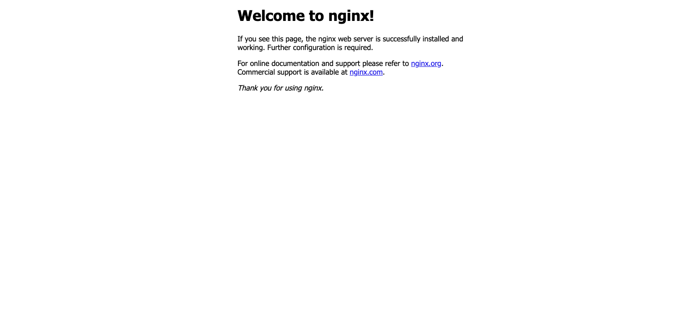
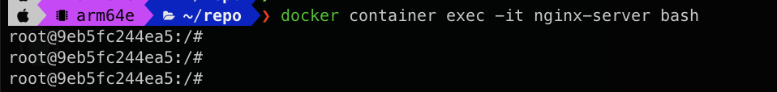
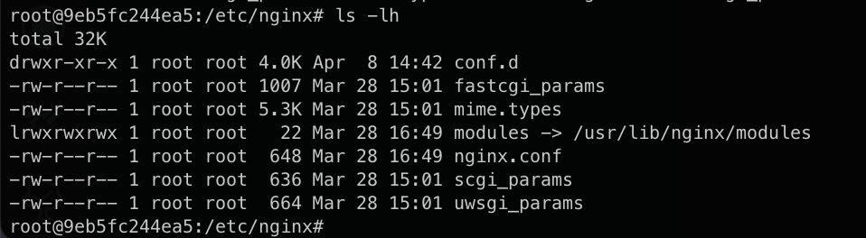
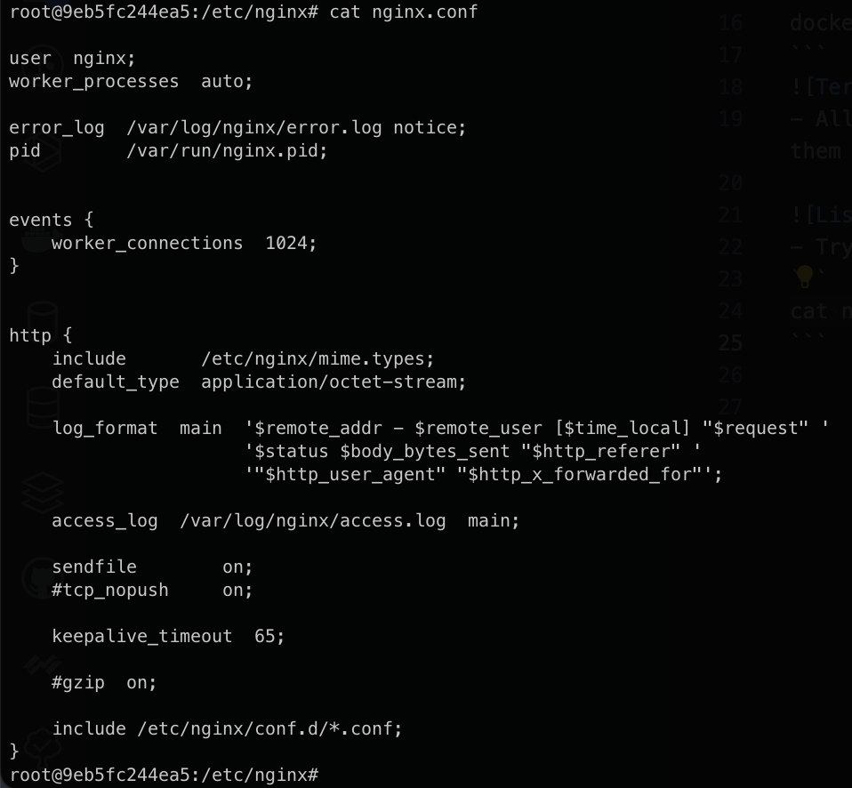
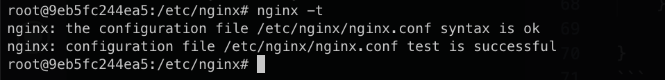
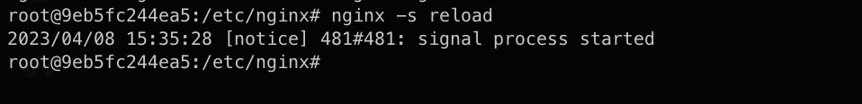
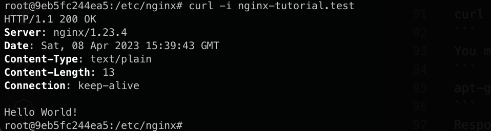

## How to configure the basic NGINX server.

**Step 1: Start Nginx server**

- Run the command to start Nginx server by Docker:

```
docker container run -d -p 8080:80 --name nginx-server nginx
```

- On browsers try to hit and see response

```
http://localhost:8080/
```


**Step 2: Config Nginx**

- Access to Nginx server by command:

```
docker container exec -it nginx-server bash
```



- All of config nginx file have suffix is `.conf`. You can see them in `/etc/nginx`



- Try to see content of `nginx.conf`

```
cat nginx.conf
```



- To modify the configuration file we will use Vim editor to edit it. Because the this container don't have it. So we will install by run command.

```
apt-get update
apt-get install vim
```

- To modify the configuration file run command. To use Vim editor, you can visit the [link](https://www.makeuseof.com/how-to-use-vim/).

```
vi nginx.conf
```

- Try to change nginx.conf file contents to

```
events {

}

http {

    server {

        listen 80;
        server_name nginx-tutorial.test;

        return 200 "Hello World!\n";
    }

}
```
- Add this line to `/etc/hosts` file
```
127.0.0.1 nginx-tutorial.test
```
- To check config file syntax is correct run command
```
nginx -t
```

- Now we need to reload nginx to apply new configuration.
```
nginx -s reload
```



- Now we can test `nginx-tutorial.test` just created

```
curl -i nginx-tutorial.test
```
> You maybe install `curl` to run commands above
```
apt-get install curl
```
Response

That all !!!

## Config Nginx for Reverse Proxy.

- To use Reverse Proxy, you can add `location` directive in nginx.conf.
```
events {

}


http {
        include /etc/nginx/mime.types;

        server {
        listen 80;

        server_name nginx-tutorial.test;

        location / {
           proxy_pass "https://www.google.com/";
        }
    }
}
```
- Then run the following command
```
nginx -t # Check the syntax of the config file

nginx -s reload # Reload Nginx.
```
- Now when you send request to `http://localhost:8080/` nginx will handle this request and send it to `https://google.com/` and wait for the response from `https://google.com/`. And finally nginx will send the response to the browser and you can see Google page on your browser.